# __Hangman - Portfolio Project 3__

## How to play

* This is a Python terminal game and is deployed on Heroku using Code Institutes mock terminal template.
* Before starting the game the user is asked to enter their name and then gets a welcoming message before the game beginns.
* The user is then informed that they have 6 sttemps to guess a correct word before the game ends.
* If the user gets a correct letter their lives do not decrease but if the user types in a wrong letter their lives decrease by one.
* The game will display a series of underscores, each representing a letter of the word to be guessed.
* Enter a letter to guess. If the letter is present in the word, the game will reveal its position in the word.
* If the letter is not present in the word, the game will draw a body part of the hangman sketch.
* Continue guessing until either the word is correctly guessed or the stick figure is complete.
* If all letters are guesssed correctly the complete hangman sketch is not drawn and the user wins.
* The user looses by getting all 6 guesses wrong and thus the hangman sketch is drawn.
* When the game is over the user is prompted if they want to start a new game by choosing (y/n).
* If user chooses 'y' the game restarts and if user chooser 'n' the game ends with the message 'Thanks for playing hangman, see you next time'.

The deployed live game can be found at [Hangman Game](https://hang-men.herokuapp.com/)

### __User stories__

- As a player, I want to see a visual representation of the hangman so that I can keep track of my progress and know how many incorrect guesses I have left.
- As a player, I want to be able to see how many letters I need to guess.
- As a player, I want to be able to enter a letter guess so that I can try to guess the word.
- As a player, I want to see which letters I have already guessed so that I don't repeat the same letter.
- As a player, I want to receive feedback after each guess so that I know whether my guess was correct or not.
- As a player, I want to know how many letters are in the word so that I can make an informed guess.
- As a player, I want to be able to restart the game after the game has finished without exiting the program to do so.

### __Flowchart__
I made a flowchart so that it can help me with planning and visualizing the structure of the game.

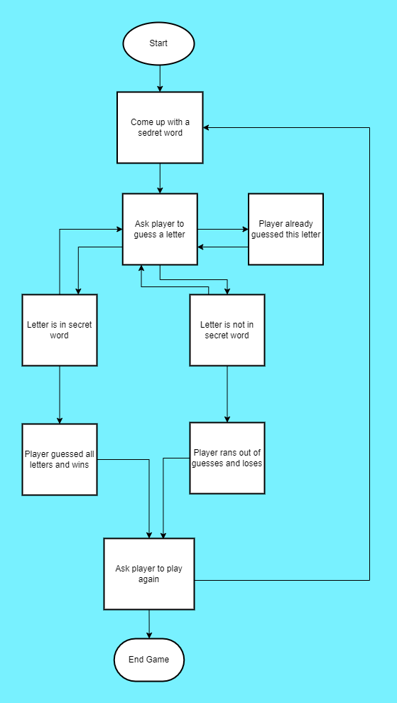

## __Features__

- __Welcome Screen__
    - The player is welcomed to the game and prompted to input their name.

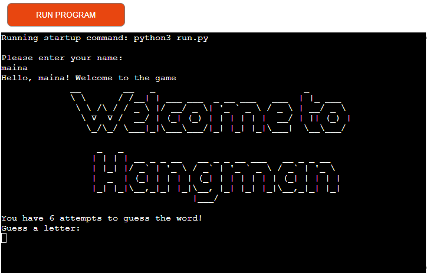

- __Main Game__
    - This is the main feature of the program. The user is met with a graphic displaying the hangman.
    - The player is promtped with underscores ( _ ) to let them know how many letters are in the word.
    - The player can enter letters until they either get the word correct or run out of lives.
    - if the player gets the correct letter the letter is added to the underscore.

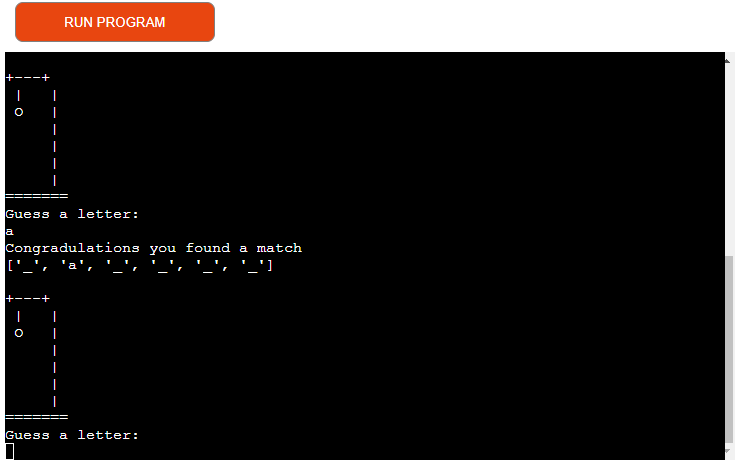

- If the player gets the wrong guess their lives number depreciates by 1 and the hangman sketch starts being drawn step by step

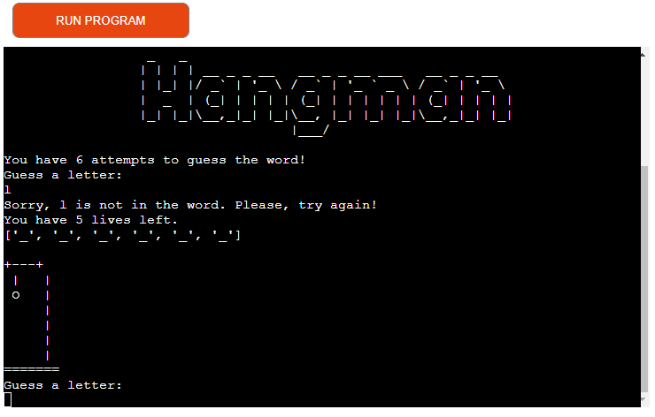

- If a user enters a letter that they have guessed previously, they will be reminded of this and prompted to try again without losing a life.

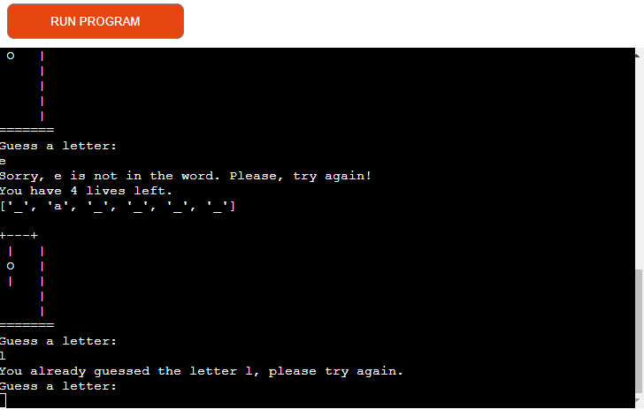

- If a user guessed double letters, they will get the alert 'please pick a single letter' 
- If a user guessed an integer, they will get the alert 'please enter a letter'

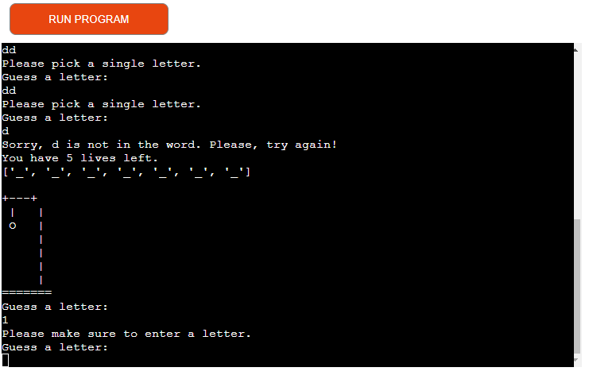

- Once the game is over and the user has either won or lost, they will be asked if they want to play again.If they choose 'y' the game starts again if they choose another letter the game ends with the message 'see you next time'

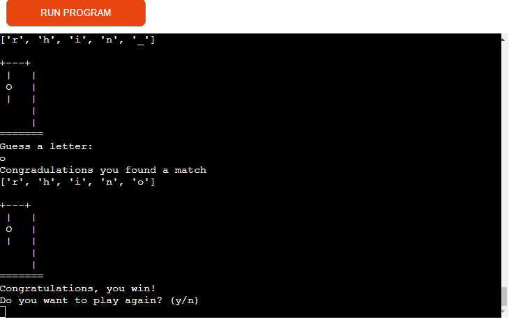

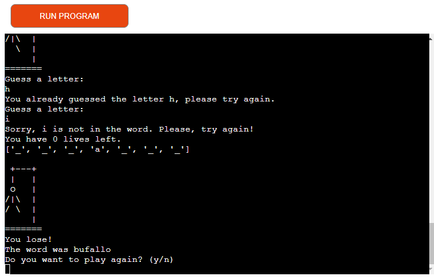

### __Technologies Used__
The following is a list of the technologies I used on this project.

- [Python](https://en.wikipedia.org/wiki/Python_(programming_language)) was used for the coding of the game.
- [PyFiglet](https://pypi.org/project/pyfiglet/0.7/) was used to print large text seen on the welcome message when the program starts.
- [JavaScript](https://en.wikipedia.org/wiki/JavaScript) The script used to run the Code Institute mock terminal is done with JavaScript.
- [Techsini](http://techsini.com/multi-mockup/index.php) was used to generate mockups for the project.
- [Github](https://github.com/) was used to store the project's code after being pushed from Git.
- [Gitpod](https://gitpod.io/) terminal was used to commit my code using Git and push it to Github.
- [Git](https://git-scm.com/) was used for version control through the Gitpod terminal.
- Custom module: hangman_letters containing a list of words to be used in the game.

## __Testing and Validation__
I validated my run.py and hangman_letters.py using [Code Institute's Python Linter](https://pep8ci.herokuapp.com/) and no errors were found.

- run.py validation

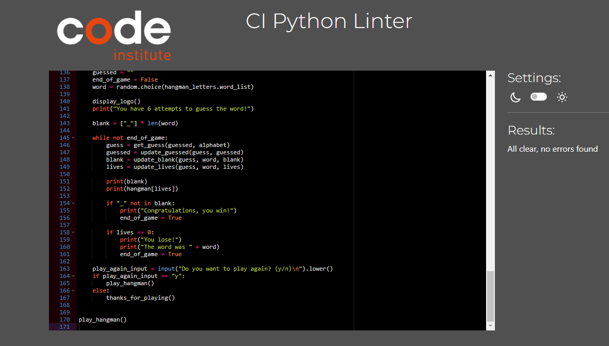

- hangman-letters validation

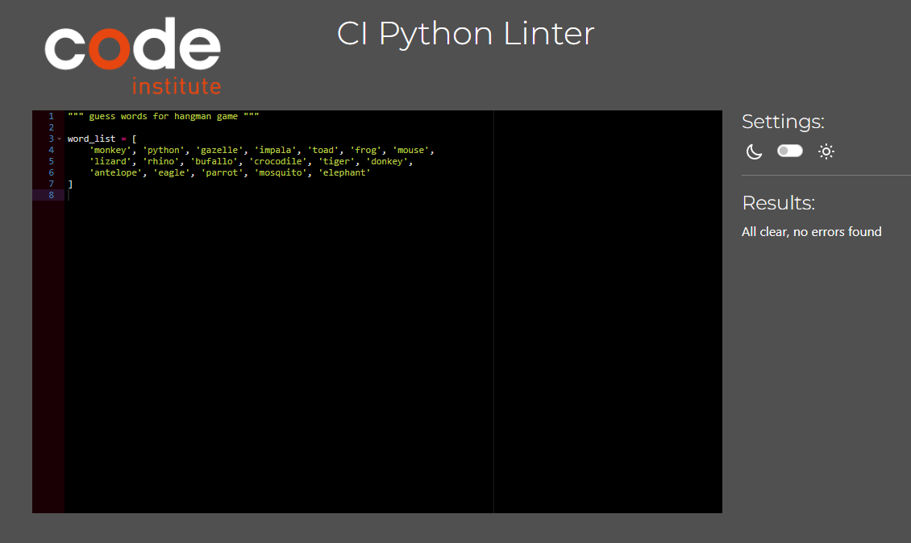

## User Stories Testing
ID | Player stories | Requirement met |
| - | --------- | --------------- |
| 1 | As a player, I want to be able to input my name. | Yes | 
| 2 | As a player, I want to be able to see how many attempts I have to guess the word. | Yes | 
| 3 | As a player, I want to be able to see all the letters I guessed. | Yes |
| 4 | As a player, I want to be warned if I try to guess a letter I've already guessed. | Yes |
| 5 | As a player, I want to receive feedback after each guess so that I know whether my guess was correct or not.| Yes |
| 6 | As a player, I want to be able to play again after the game has finished without exiting the program. | Yes |

## Program Validation Testing
Section Tested | Input To Validate | Expected Outcome | Pass/Fail
| - | --------- | --------------- | - | 
| Start Program	| N/A |	Load welcome message and prompt user to enter name |	PASS
| Enter Name	| Input "maina" |	Move on to the game + presents "Hallo, {username} welcome to the game!" | PASS
| Guess a letter |	Input a number	| Error message warning to enter a single letter. | PASS
| Guess a letter |	Input two letters	| Error message warning to enter a single letter. | PASS
| Guess a letter |	Press enter with no input	| Error message warning to enter a single letter. | PASS
| Guess a letter |	Correct letter	| Display the letter in the correct space of the dashed word | PASS
| Guess a letter |	Correct letter	| Display the letter in the "Guessed letters" list | PASS
| Guess a letter |	Correct letter	| Doesn't subtract 1 from "Attempts remaining" | PASS
| Guess a letter |	Incorrect letter	| Subtract 1 from "Attempts remaining" | PASS
| Guess a letter |	Incorrect letter | Display the letter in the "Guessed letters" list | PASS
| Guess a letter |	Letter already guessed	| Error message: "letter" was already guessed. Try another letter.| PASS
| Play Again after make a point | "Y" | Start a new game manteining the score | Pass
| Play Again | Input anything other than "Y" | Exit the program | Pass

## Browser Testing

Ensuring all parts of the programm function as expected in all major browsers.

| Browser     | Layout      | Functionality |
| :---------: | :----------:| :-----------: |
| Chrome      | ✔          | ✔             |
| Edge        | ✔          | ✔             |
| Firefox     | ✔          | ✔             |
| Safari      | ✔          | ✔             |

- Performance, Accessibility, SEO, Best Practices (Lighthouse Chrome DevTools)

    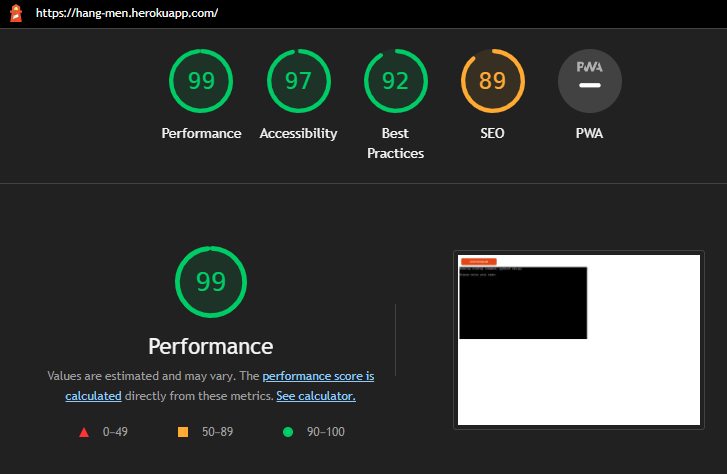

## Bugs
* A missing-module-docstring error indicated that the module imports at the start of the game required an additional docstring.

